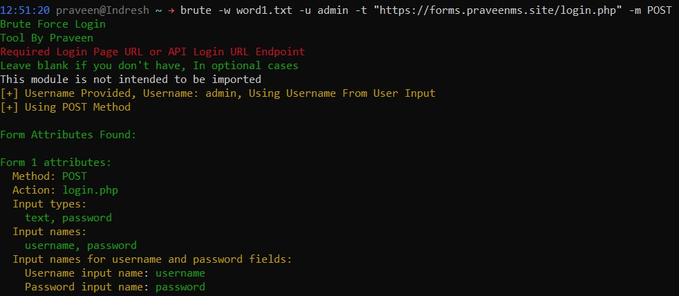
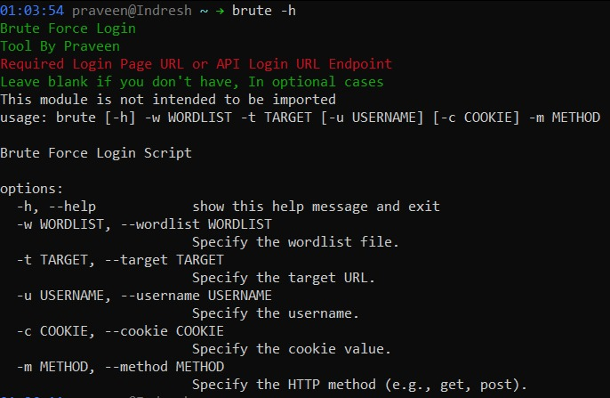
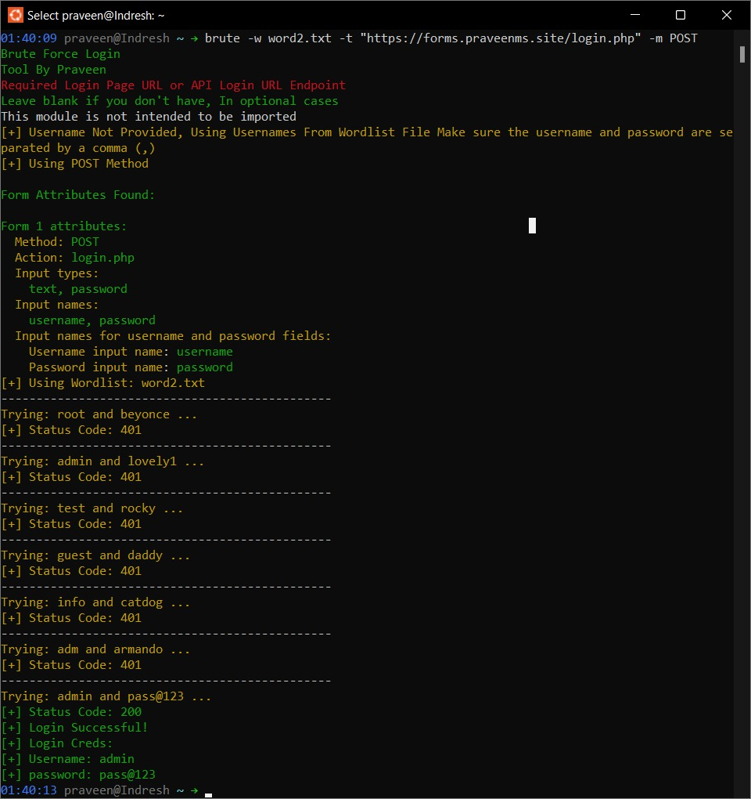

# Brute Force Login Tool


## Overview

This is a simple Brute Force Login tool written in Python. It is designed to assist in testing the security of login forms or API login endpoints. The tool supports both GET and POST HTTP methods for brute force attacks and gives results based on the retrieved status code.

## Prerequisites

- Python3
- PIP


## Features

- **Form Analysis:** Extracts and analyzes HTML form attributes to identify input names for username and password fields, extracts the `type` of an input tag or button tag, also extracts all the required tokens, cookies for a login session.

<p align="center">
  
</p>

- **Wordlist Attack:** Supports username and password brute force attacks using a provided wordlist file.
- **GET and POST Methods:** Choose between GET and POST methods based on the target's login mechanism.
- **Cookie Support:** Optionally provide a cookie value for authentication.
- **User-friendly Interface:** Provides clear and colored console output for better user interaction.

## Installation (Release from PyPI)

[](https://pypi.org/project/brute-force-attacker/) [](https://en.wikipedia.org/wiki/Linux)


Install the `brute-force-attacker` package using pip:
Find the latest release on <a href="https://pypi.org/project/brute-force-attacker/">PyPI</a>.

```bash
pip install brute-force-attacker
```


### Run as command line tool

```
brute -w <wordlist_file> -t <target_url> -m <http_method> [-u <username>] [-c <cookie_value>]
```

- `-t` or `--target`: Specify the target URL.
- `-w` or `--wordlist`: Specify the wordlist file.
- `-m` or `--method`: Specify the HTTP method (get or post).

Optional arguments:

- `-u` or `--username`: Specify the username for targeted brute force (optional).
- `-c` or `--cookie`: Specify the cookie value for authentication (optional).

## Help Menu
<p align="center">
  
</p>

## Tool Usage (GET)

### 1. Brute Force Login using GET with Username


```
brute -w word1.txt -t "https://forms.praveenms.site/login.php?username=admin&password=" -m GET
```

### 2. Brute Force Login using GET with Username


```
brute -w word2.txt -t "https://forms.praveenms.site/login.php?username=&password=" -m GET
```
<hr>

## Tool Usage (POST)

### 1. Brute Force Login using POST with username

```
brute -w word1.txt -u admin -t "https://forms.praveenms.site/login.php" -m POST
```

### 2. Brute Force Login using POST without username

```
brute -w word2.txt -t "https://forms.praveenms.site/login.php" -m POST
```
<hr>


## Scren Shots

<p align="center">
  
</p>

<hr>

## Disclaimer

This tool is intended for educational and testing purposes only. Unauthorized access to systems or networks without permission is illegal.

## License 

 

 <a href="https://choosealicense.com/licenses/mit/">MIT</a>

### Target Site: https://forms.praveenms.site/login.php

The above site is used to test the Brute force login


## Social Media Links: 

<a href="https://www.instagram.com/praveen.ms_13/">
  
</a><a href="https://www.linkedin.com/in/m-s-praveen-kumar-2243b622a/">
  
</a><a href="https://github.com/Praveenms13">
  
</a><a href="https://www.praveenms.site/">
  
</a>